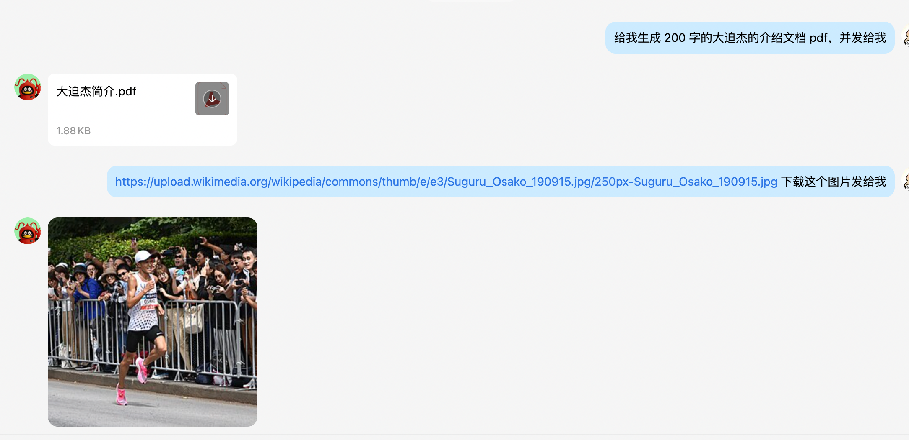

# XDMINICLAW ·  QQ AI 助手

> 基于 **Spring AI Alibaba** + **通义千问** 构建的全功能 QQ 机器人，集成 ReAct Agent、长期记忆、RAG 知识库、Skill 扩展体系等能力。

---

## 目录

1. [项目简介](#1-项目简介)
2. [核心特性](#2-核心特性)
3. [技术栈](#3-技术栈)
4. [系统架构](#4-系统架构)
5. [模块详解](#5-模块详解)
6. [数据流向](#6-数据流向)
7. [快速开始](#7-快速开始)
8. [配置说明](#8-配置说明)
9. [工具列表](#9-工具列表)
10. [Skill 扩展体系](#10-skill-扩展体系)
11. [记忆体系](#11-记忆体系)
12. [RAG 知识库](#12-rag-知识库)
13. [文件收发机制](#13-文件收发机制)
14. [内置指令](#14-内置指令)
15. [常见问题](#15-常见问题)
16. [目录结构](#16-目录结构)

---

## 1. 项目简介
<div style="display:flex;gap:8px;">
  
  
  
</div>


XDMINICLAW（小小豆）是一个运行在 QQ 上的智能助手机器人，基于 QQ 开放平台官方 WebSocket 接口接入，由 Spring Boot + Spring AI Alibaba 驱动，底层大模型使用阿里云通义千问系列。

机器人支持私聊（C2C）和频道私信，具备工具调用（ReAct 循环）、长/短期记忆、RAG 知识库检索、Skill 动态扩展等能力，可在对话中完成天气查询、PDF 生成、网络搜索、文件收发、PPT 优化、代码执行等复杂任务。

---

## 2. 核心特性

| 特性 | 说明 |
|---|---|
| **ReAct Agent** | 基于 Spring AI Alibaba `ReactAgent`，支持多轮工具调用与推理 |
| **多轮对话记忆** | Kryo 文件持久化 checkpoint，重启后记忆不丢失 |
| **混合记忆压缩** | 滑动窗口 + 摘要压缩，长对话自动压缩为摘要，节省 token |
| **长期记忆（pgVector）** | 重要信息异步提炼写入向量数据库，跨会话持久记住用户偏好/身份 |
| **RAG 知识库** | 本地 `.md/.txt` 文档向量化，语义检索增强回复准确性 |
| **Skill 扩展** | 集成 Spring AI Alibaba Skills 体系，6 个预装 Skill，支持从市场动态安装 |
| **文件收发** | 接收用户发来的图片/文件自动下载；生成文件主动推送给用户 |
| **14 个内置工具** | 天气、搜索、PDF、PPT、DOCX、XLSX、终端、下载等全覆盖 |
| **虚拟线程** | JDK 21 虚拟线程异步处理，高并发低开销 |

---

## 3. 技术栈

### 核心框架

| 技术 | 版本 | 用途 |
|---|---|---|
| Spring Boot | 3.4.4 | 应用框架，依赖注入，配置管理 |
| Spring AI Alibaba | 1.1.2.0 | AI 能力核心，ReAct Agent，工具调用，向量存储 |
| Spring AI | 1.1.2 | pgVector 向量存储，文本切分 |
| Java | 21 | 虚拟线程（Project Loom） |

### AI 与大模型

| 技术 | 说明 |
|---|---|
| **通义千问 qwen-plus** | 主对话模型，ReAct 推理，temperature=0.7 |
| **通义千问 qwen-turbo** | 轻量模型，用于摘要压缩和记忆提炼，降低成本 |
| **DashScope text-embedding-v3** | 文本向量化（1024 维），用于长期记忆和 RAG 索引 |
| **DashScope API** | 阿里云 AI 服务平台，兼容 OpenAI 接口规范 |

### 存储

| 技术 | 用途 |
|---|---|
| **PostgreSQL 14+ + pgvector** | 向量数据库，HNSW 索引，余弦距离，存储长期记忆和 RAG 文档 |
| **Kryo 5.6** | 高性能二进制序列化，持久化 Agent 对话 checkpoint 到本地文件 |
| **本地文件系统** | `./data/memory/` 存对话历史；`./tem/` 存生成文件；`./tem/received/` 存用户上传文件 |

### 网络与 Bot

| 技术 | 用途 |
|---|---|
| **OkHttp 4.12** | WebSocket 长连接（QQ 网关），HTTP 文件上传/发送 |
| **QQ 开放平台** | 官方机器人 API，C2C/频道私信事件，媒体富文本发送 |
| **Jsoup 1.19** | 网页内容抓取与解析 |

### 工具库

| 技术 | 用途 |
|---|---|
| **iText 9.1** | PDF 生成，嵌入 STSongStd-Light 支持中文 |
| **Hutool 5.8** | 文件操作工具集 |
| **Jackson** | JSON 序列化，解析 QQ WebSocket 事件帧 |
| **Lombok 1.18** | 减少样板代码（@Slf4j、@Data、@RequiredArgsConstructor） |
| **MyBatis-Plus 3.5** | 数据库 ORM（预留扩展） |

### Skill 扩展底层

| 技术 | 用途 |
|---|---|
| **Spring AI Alibaba Skills** | Skill 注册表、AgentHook、`read_skill` 工具，渐进式能力披露 |
| **npx skills CLI** | Skill 市场命令行，搜索/安装 npm 托管的 skill 包 |
| **pptxgenjs（npm）** | pptx skill 底层，Node.js 生成 PPTX |
| **docx（npm）** | docx skill 底层，Node.js 生成 Word 文档 |
| **pandas + openpyxl** | xlsx skill 底层，Python 操作 Excel |
| **pypdf + pdfplumber + reportlab** | pdf skill 底层，Python 处理 PDF |

---

## 4. 系统架构

```
┌─────────────────────────────────────────────────────────────────┐
│                        QQ 开放平台                               │
│   C2C_MESSAGE_CREATE / DIRECT_MESSAGE_CREATE (WebSocket OP=0)   │
└─────────────────────┬───────────────────────────────────────────┘
                      │ OkHttp WebSocket
                      ▼
┌─────────────────────────────────────────────────────────────────┐
│                     QQBotClient                                  │
│  • Identify/Resume 鉴权  • 心跳维持（OP=1）  • 断线重连          │
│  • 解析 attachments → 下载附件到 ./tem/received/                 │
│  • 发送文本（msg_type=0）/ 媒体（msg_type=7，Base64上传）        │
└─────────────────────┬───────────────────────────────────────────┘
                      │ @Async 虚拟线程
                      ▼
┌─────────────────────────────────────────────────────────────────┐
│                 MessageProcessorService                          │
│  • 消息去重（senderId + content + 时间秒级）                      │
│  • 指令路由（/help /status /clear /forget）                      │
│  • 设置 UserContextHolder（ThreadLocal）                         │
└─────────────────────┬───────────────────────────────────────────┘
                      │
                      ▼
┌─────────────────────────────────────────────────────────────────┐
│                      AiService                                   │
│  • 注入长期记忆（pgVector → 前缀追加，300s 时间窗口节流）          │
│  • 调用 ReactAgentService.chat()                                 │
│  • 虚拟线程异步触发 MemoryExtractorService 提炼记忆               │
└─────────────────────┬───────────────────────────────────────────┘
                      │
                      ▼
┌─────────────────────────────────────────────────────────────────┐
│                  ReactAgentService                               │
│  • trimHistory()：读取历史 → 混合记忆策略（压缩/裁剪）→ 写回      │
│  • ReactAgent.call(userText, config)                             │
└─────────────────────┬───────────────────────────────────────────┘
                      │
                      ▼
┌─────────────────────────────────────────────────────────────────┐
│            ReactAgent（Spring AI Alibaba）                       │
│                                                                  │
│  ┌─────────────────┐  ┌──────────────────────────────────────┐  │
│  │  SkillsAgentHook│  │  14 个 @Tool                          │  │
│  │  .agents/skills │  │  天气/搜索/PDF/文件/终端/QQ发送/       │  │
│  │  autoReload=off │  │  向量检索/Skill管理...                 │  │
│  └─────────────────┘  └──────────────────────────────────────┘  │
│                                                                  │
│  ┌──────────────────────────────────────────────────────────┐   │
│  │  KryoFileSaver  →  ./data/memory/{threadId}.kryo          │   │
│  └──────────────────────────────────────────────────────────┘   │
└─────────────────────┬───────────────────────────────────────────┘
                      │
          ┌───────────┼──────────────────────┐
          ▼           ▼                      ▼
   通义千问        pgVector                本地文件
   qwen-plus      long_term_memory 表      ./tem/
   qwen-turbo     （长期记忆 + RAG 文档）
```

---

## 5. 模块详解

### 5.1 QQBotClient — QQ 接入层

负责与 QQ 开放平台的所有网络交互，是整个系统的入口和出口。

**连接流程：**
1. `appId + clientSecret` → `POST bots.qq.com/app/getAppAccessToken` → 获取 `access_token`
2. `GET api.sgroup.qq.com/gateway` → 获取 WebSocket 接入地址
3. OkHttp 建立 WebSocket 长连接
4. 收到 `OP=10 HELLO` → 启动心跳 + 发送 `OP=2 IDENTIFY` 完成鉴权
5. 断线后自动重连，支持 `OP=6 RESUME` 恢复 session，避免重复鉴权

**附件接收：**
用户发送图片或文件时，消息 payload 的 `attachments` 数组中包含 CDN 下载链接，Bot 自动下载到 `./tem/received/`（文件名加毫秒时间戳前缀防冲突），并将本地路径追加到消息文本，使 AI 能感知到收到了文件。

**媒体发送：**
分两步：① Base64 编码文件内容，`POST /v2/users/{openid}/files` 上传获取 `file_info` token；② 发送 `msg_type=7` 媒体消息引用该 token。根据文件扩展名自动判断文件类型：图片(1)/视频(2)/语音(3)/普通文件(4)。

### 5.2 MessageProcessorService — 消息处理

消息进入系统后的第一道处理层：

- **去重**：以 `senderId + content + 时间秒级` 为 key，防止 QQ 重发导致重复处理（最多缓存 1 万条）
- **指令路由**：识别内置命令直接处理，不走 AI 推理
- **上下文绑定**：将用户的 `openId` 和 `msgId` 存入 `UserContextHolder`（ThreadLocal），供工具层获取当前用户身份
- **threadId 规则**：`"qq_" + openId`，同一 QQ 用户始终对应同一记忆空间

### 5.3 AiService — AI 门面

封装 AI 调用细节，管理长期记忆的注入时机：

- **长期记忆注入**：每次对话前查询 pgVector，将相关历史记忆拼入 Prompt 前缀；引入 **300 秒节流**（同一用户 5 分钟内只注入一次），避免每轮都查库
- **异步记忆提炼**：AI 回复完成后，用虚拟线程启动 `MemoryExtractorService` 在后台分析本轮对话，提炼重要信息写入 pgVector，不阻塞主流程

### 5.4 ReactAgentService — ReAct 驱动

持有并驱动 `ReactAgent`：

**记忆修剪（trimHistory）：** 每次 `chat()` 前从 KryoFileSaver 读取历史 checkpoint，分离系统消息与对话历史，交给 `ConversationMemoryManager` 处理，将压缩/裁剪后的结果写回，防止 token 窗口溢出。

### 5.5 ConversationMemoryManager — 混合记忆策略

解决长对话 token 溢出问题，两种策略结合：

| 策略 | 触发条件（默认值） | 效果 |
|---|---|---|
| **摘要压缩** | 对话轮数 ≥ 20 轮 | 用 qwen-turbo 将最早 15 轮压缩为 ≤200 字中文摘要，以 `[历史摘要]` SystemMessage 保留 |
| **滑动窗口** | 压缩后仍 > 5 轮 | 直接丢弃最早的消息 |

两种策略协同工作：先压缩减小总量，再用窗口兜底，既保留语义信息又控制 token 用量。摘要支持累积合并，多轮压缩后仍是一条连贯摘要。

### 5.6 KryoFileSaver — 对话持久化

继承 Spring AI Alibaba 的 `MemorySaver`，将 Agent checkpoint 持久化到本地文件：

- **文件路径**：`./data/memory/{threadId}.kryo`
- **写入安全**：先写 `.tmp` 临时文件，成功后原子 rename，防止写入中断导致文件损坏
- **序列化扩展**：注册了 JDK 不可变集合（`List.of()`、`Map.of()` 等）的自定义序列化器，解决 Kryo 默认无法序列化这些类型的问题

### 5.7 LongTermMemoryService — 长期记忆

pgVector 向量数据库的封装层，以 `threadId` 为 namespace 隔离不同用户：

```
Document {
  content: "用户偏好代码简洁，不喜欢冗长注释"
  metadata: {
    source: "long_term_memory",
    threadId: "qq_01F4ED...",
    category: "preference",
    createdAt: "2024-04-10T..."
  }
}
```

| 方法 | 说明 |
|---|---|
| `remember(threadId, content, category)` | 写入带 metadata 的 Document，自动向量化 |
| `recall(threadId, query, topK)` | 按 threadId 过滤 + 语义相似度检索，返回去重文本列表 |
| `forgetAll(threadId)` | 按 threadId 过滤删除该用户全部长期记忆 |

### 5.8 MemoryExtractorService — 记忆提炼

每轮对话结束后在后台运行，用 qwen-turbo 分析对话内容：

```
Prompt 结构：
  用户：{userText}
  助手：{assistantReply}

输出格式：[category] 内容（≤30字）
无重要信息输出：NONE

示例输出：
  [preference] 用户喜欢简洁回答，不要 emoji
  [role] 用户是 Java 后端开发工程师
```

支持的记忆类别：`preference`（偏好）、`personality`（性格）、`role`（身份）、`fact`（事实）及模型自定义类别（如 `goal`、`skill`）。

---

## 6. 数据流向

```
用户 QQ 消息
    │
    ├─ 含图片/文件 ──→ downloadAttachment() → ./tem/received/xxx.jpg
    │                  ↓ 文件路径追加到 content
    │
    ▼
MessageProcessorService.processAsync()     [@Async 虚拟线程]
    │
    ├─ 指令（/help 等） ──→ 直接返回固定文本
    │
    ▼
AiService.chat()
    │
    ├─ pgVector 查询长期记忆（300s 节流）──→ 前缀注入 Prompt
    │
    ▼
ReactAgentService.chat()
    │
    ├─ trimHistory()：
    │     KryoFileSaver.get() → ConversationMemoryManager.apply()
    │     → 摘要压缩 / 滑动窗口 → KryoFileSaver.put()
    │
    ▼
ReactAgent.call(userText, config)
    │
    ├─ SkillsAgentHook：注入已安装 skill 元信息到 System Prompt
    │
    ├─ qwen-plus 推理
    │
    ├─ 需要工具 → @Tool 执行
    │    ├─ 查天气/搜索/计算 → 直接返回文本
    │    ├─ 生成 PDF/文件 → ./tem/xxx.pdf
    │    └─ 发文件给用户 → Base64上传 → msg_type=7
    │
    └─ 最终回复 → QQBotClient.sendMessage() → 用户 QQ
         │
         └─ [后台虚拟线程] MemoryExtractorService.extractAsync()
               → qwen-turbo 分析 → LongTermMemoryService.remember()
               → pgVector 写入
```

---

## 7. 快速开始

### 前置依赖

| 依赖 | 版本要求 | 用途 |
|---|---|---|
| Java | 21+ | 虚拟线程支持 |
| Maven | 3.8+ | 构建 |
| PostgreSQL | 14+ + pgvector 扩展 | 向量数据库 |
| Node.js | 18+ | Skill 市场 CLI（可选） |
| Python | 3.10+ | xlsx/pdf Skill（可选） |

### 第一步：准备数据库

```sql
-- 创建数据库和用户
CREATE DATABASE xd_claw;
CREATE USER myuser WITH PASSWORD '12345678';
GRANT ALL PRIVILEGES ON DATABASE xd_claw TO myuser;

-- 连接到 xd_claw 后安装 pgvector 扩展
\c xd_claw
CREATE EXTENSION IF NOT EXISTS vector;
```

> `spring.ai.vectorstore.pgvector.initialize-schema=true` 会自动建表，无需手动建表。若向量维度报错，先执行 `DROP TABLE IF EXISTS long_term_memory;` 再重启。

### 第二步：获取必要 Key

| Key | 获取方式 |
|---|---|
| 通义千问 API Key | [DashScope 控制台](https://dashscope.aliyun.com/) → API Key 管理 |
| QQ 机器人凭证 | [QQ 开放平台](https://q.qq.com/) → 创建机器人 → AppId + ClientSecret |
| 高德地图 Key | [高德开放平台](https://lbs.amap.com/) → 创建应用（Web服务类型） |
| SearchAPI Key | [SearchAPI.io](https://www.searchapi.io/) → 注册获取 |

### 第三步：修改配置

编辑 `src/main/resources/application.yml`：

```yaml
spring:
  datasource:
    url: jdbc:postgresql://localhost:5432/xd_claw
    username: myuser          # 修改为你的数据库用户
    password: 12345678        # 修改为你的数据库密码
  ai:
    dashscope:
      api-key: sk-xxxxxxxx    # 填入通义千问 API Key

xdclaw:
  qq:
    app-id: 你的AppId
    client-secret: 你的ClientSecret

amap:
  api-key: 你的高德APIKey

search-api:
  api-key: 你的SearchAPIKey
```

### 第四步：构建与运行

```bash
# 指定 Java 21 编译（非默认 JDK 时需要）
export JAVA_HOME=/path/to/java21

# 全量编译
./mvnw clean compile

# 运行
./mvnw spring-boot:run

# 或打包后运行
./mvnw package -DskipTests
java -jar target/XDMINICLAW-0.0.1-SNAPSHOT.jar
```

**启动成功标志：**
```
INFO  QQBotClient - 连接 Gateway: wss://api.sgroup.qq.com/websocket
INFO  QQBotClient - 已就绪，session_id=xxxxxx
INFO  RagIndexingService - [RAG] 索引完成，共处理 1 个文件，新写入 N 个分块
```

### 第五步：测试

在 QQ 开放平台「沙箱配置」中添加你的 QQ 号为测试用户，然后：

```
你 → 帮助
小小豆 → 显示功能列表

你 → 北京今天天气
小小豆 → 北京市 东城区 天气：晴，气温 22°C，南风 ≤3级，湿度 20%...

你 → 帮我生成一个介绍 Spring AI 的 PDF
小小豆 → [调用 generatePDF] [调用 sendTempFile] 发送 PDF 文件
```

---

## 8. 配置说明

### 完整配置参考

```yaml
xdclaw:
  qq:
    app-id: ""                                    # QQ 机器人 AppId
    client-secret: ""                             # QQ 机器人 ClientSecret
    intents: 33558528                             # (1<<25)|(1<<12) 单聊+频道私信

  ai:
    skills-dir: .agents/skills                   # Skill 目录（搜索与安装共用）
    system-prompt: |                              # Agent 系统提示词（支持多行）
      你是小小豆...
    timeout-seconds: 30                           # Agent 最大执行超时（秒）
    memory-dir: ./data/memory                    # 对话 checkpoint 存储目录
    memory-window-turns: 5                        # 滑动窗口保留最近 N 轮
    memory-compress-trigger-turns: 20             # 摘要压缩触发阈值（轮数）
    memory-compress-batch-turns: 15               # 每次压缩最早 N 轮
    summary-model: qwen-turbo                    # 摘要/记忆提炼用轻量模型
    long-term-memory-enabled: true                # 是否启用长期记忆
    long-term-memory-inject-interval-seconds: 300 # 记忆注入节流（秒）
    long-term-memory-top-k: 5                    # 长期记忆检索 Top-K

spring:
  ai:
    dashscope:
      api-key: ""                                 # 通义千问 API Key
      chat.options:
        model: qwen-plus                          # 主对话模型
        temperature: 0.7
    vectorstore:
      pgvector:
        initialize-schema: true                   # 自动建表（首次启动）
        index-type: HNSW                          # 向量索引类型
        distance-type: COSINE_DISTANCE            # 余弦距离
        dimensions: 1024                          # DashScope embedding 固定 1024 维
        table-name: long_term_memory              # 存储表名
```

### 关键注意事项

**向量维度必须为 1024**：DashScope `text-embedding-v3` 输出 1024 维，若表已按其他维度（如 1536）建立，需先 `DROP TABLE long_term_memory;` 重建。

**intents 值说明**：`33558528 = (1<<25) | (1<<12)`，分别对应单聊消息和频道私信权限，需在 QQ 开放平台对应机器人应用中申请这两项权限。

**关闭长期记忆**：设置 `long-term-memory-enabled: false` 可在没有 PostgreSQL 环境时跳过向量库相关功能，不影响基础对话。

---

## 9. 工具列表

Agent 内置以下工具，在对话中自然表达需求，Agent 自动判断调用：

| 工具 | 触发场景示例 | 实现细节 |
|---|---|---|
| `getWeather(city)` | "北京今天天气怎么样" | 高德地图 `/v3/weather/weatherInfo`，支持中文城市名 |
| `getDateTime()` | "现在几点了" | 系统时间，格式化输出 |
| `calculate(expr)` | "69乘66除33等于多少" | 数学表达式计算 |
| `searchWeb(query)` | "搜索最新 AI 新闻" | SearchAPI 调用百度，返回前 5 条摘要 |
| `scrapeWebPage(url)` | "帮我看看这个网页的内容" | Jsoup 抓取 HTML，提取正文 |
| `searchImages(query)` | "搜一张猫的图片" | 图片搜索引擎接口 |
| `readFile(name)` | "读取 report.txt 的内容" | 读取 `./tem/` 目录下文件 |
| `writeFile(name, content)` | "把这段内容保存成文件" | 写入 `./tem/` 目录 |
| `generatePDF(name, content)` | "生成一个包含...的 PDF" | iText 9，嵌入中文字体 |
| `downloadResource(url)` | "下载这个链接的文件" | OkHttp 流式下载 |
| `executeTerminalCommand(cmd)` | "执行 ls -la" | ProcessBuilder，Shell 执行 |
| `sendFileToQQUser(path)` | "把这个文件发给我" | Base64 上传 + msg_type=7 媒体消息 |
| `listTempFiles()` | "tem 下有哪些文件" | 递归扫描 `./tem/` 返回文件列表 |
| `sendTempFile(name)` | "把 report.pdf 发给我" | 发送 tem 目录中指定文件 |
| `sendAllTempFiles()` | "把所有文件都发给我" | 批量遍历发送 tem 目录全部文件 |
| `searchMemory(query, topK)` | "你还记得我说过什么" | pgVector 按 threadId 过滤语义检索 |
| `searchKnowledgeBase(query, topK)` | "你都有哪些功能" | pgVector 按 source=rag 过滤语义检索 |
| `searchSkills(query)` | "找一个代码审查 skill" | `npx skills find <query>` |
| `installSkill(pkg)` | "安装 xxx/yyy@skill-name" | `npx skills add <pkg>` + 立即 reload |

---

## 10. Skill 扩展体系

### 架构原理

Spring AI Alibaba Skills 采用**渐进式披露**设计，避免将所有 Skill 指令一次性塞入 token 窗口：

```
FileSystemSkillRegistry
    └── 扫描 .agents/skills/ 目录
    └── 加载每个子目录的 SKILL.md（名称 + 简短描述）
            │
            ▼
    SkillsAgentHook (每次推理前)
    └── 将所有 Skill 名称和简描注入 System Prompt
    └── 自动注册 read_skill 工具
            │
            ▼ Agent 决定使用某 Skill
    read_skill <name>
    └── 按需加载该 Skill 完整指令（可能有几千 token）
    └── Agent 严格按指令执行任务
```

### 预装 Skills（位于 `.agents/skills/`）

| Skill | 核心功能 | 触发场景 |
|---|---|---|
| **pdf** | PDF 读取/提取/合并/拆分/创建/填表/OCR | 任何涉及 .pdf 文件的操作 |
| **docx** | Word 文档创建和编辑 | 创建报告、备忘录、信件等 .docx 文件 |
| **xlsx** | Excel 读取/编辑/创建/图表/数据分析 | 任何涉及 .xlsx/.csv 的数据处理 |
| **pptx** | PPT 创建/修改/优化，含设计规范 | 创建演讲稿、优化幻灯片 |
| **mcp-builder** | 构建 MCP 服务器，集成外部 API | 需要创建 MCP 服务 |
| **skill-creator** | 创建和优化新 Skill | 需要扩展 Agent 能力 |

### 动态安装 Skill

```
"搜索 react testing skill"
→ searchSkills("react testing")
→ 返回市场上的 skill 列表

"安装 xxx/yyy@skill-name"
→ installSkill("xxx/yyy@skill-name")
→ npx skills add 下载到 .agents/skills/
→ skillRegistry.reload() 立即生效
→ 当轮对话即可使用新 skill
```

---

## 11. 记忆体系

小小豆拥有三层记忆架构：

### Layer 1：对话上下文（会话内）

由 `ReactAgent` 维护当前会话消息列表，持久化到 `.kryo` 文件，重启恢复。每次对话前触发裁剪策略防止窗口溢出。

### Layer 2：摘要记忆（中期跨重启）

| 配置项 | 默认值 | 说明 |
|---|---|---|
| `memory-window-turns` | 5 | 滑动窗口保留最近 N 轮 |
| `memory-compress-trigger-turns` | 20 | 轮数达到此值触发摘要压缩 |
| `memory-compress-batch-turns` | 15 | 每次压缩最早 N 轮为摘要 |

压缩后摘要以 `[历史摘要]` SystemMessage 保存，支持累积合并，多轮压缩仍是一条连贯摘要。

### Layer 3：长期记忆（pgVector，永久）

```
写入：每轮 AI 回复后后台异步分析 → qwen-turbo 提炼 → pgVector 写入
      （类别：preference/personality/role/fact）

注入：每次对话前查 pgVector（300s 节流）→ 前缀追加到 Prompt
      用户主动问"你还记得..." → searchMemory 工具

删除：/forget 或 "清除长期记忆" → forgetAll(threadId)
```

### 记忆隔离

所有记忆以 `threadId = "qq_" + openId` 为 namespace，不同用户数据完全隔离。

---

## 12. RAG 知识库

### 索引流程

```
应用启动
    │
    ▼
RagIndexingService (ApplicationRunner)
    │
    ├── 扫描 classpath:/rag/*.{txt,md}
    │
    ├── 按文件名 + 内容 hash 去重（未变化跳过）
    │
    ├── TokenTextSplitter 切分（chunk=800 token，overlap=100）
    │
    └── DashScope 向量化 → pgVector 写入
          metadata: {source: "rag", fileName: "xxx.md", contentHash: "abc123"}
```

### 检索方式

RAG 采用**工具调用模式**，Agent 自行判断何时需要查知识库（非强制注入，不浪费 token）：

```
用户："小小豆有哪些功能？"
Agent → searchKnowledgeBase("功能列表", 3)
      → 返回相关文档片段
      → 基于文档内容回答，准确可靠
```

### 添加知识库文档

将 `.md` 或 `.txt` 文件放入 `src/main/resources/rag/` 目录，重启应用自动增量索引。

---

## 13. 文件收发机制

### 接收用户文件

用户通过 QQ 发送图片或文件时：
1. 解析 `attachments` 数组中的 CDN URL
2. OkHttp 下载文件到 `./tem/received/`（时间戳前缀防冲突）
3. 本地路径追加到消息文本，AI 感知文件已就绪，可读取、处理、分析

### 生成文件统一目录

所有工具/Skill 生成的文件统一存储到 `./tem/`：

```
./tem/
├── report.pdf          ← generatePDF 生成
├── data.xlsx           ← xlsx Skill 生成
├── presentation.pptx   ← pptx Skill 生成
├── output.docx         ← docx Skill 生成
└── received/
    └── 1712345678_photo.jpg  ← 用户上传
```

### 发送文件给用户

| 方式 | 说明 |
|---|---|
| `listTempFiles()` | 列出 tem 目录下所有文件 |
| `sendTempFile("report.pdf")` | 发送指定文件 |
| `sendAllTempFiles()` | 批量发送全部文件 |
| `sendFileToQQUser("/abs/path")` | 发送任意绝对路径文件 |

底层：Base64 编码 → 上传到 QQ 文件服务 → msg_type=7 媒体消息展示。

---

## 14. 内置指令

以下指令不经过 AI 处理，直接返回结果：

| 指令 | 别名 | 功能 |
|---|---|---|
| `/help` | `帮助` | 显示功能帮助列表 |
| `/status` | `状态` | 查看系统运行状态 |
| `/clear` | `清除记忆` | 清除当前用户的对话历史（短期记忆）|
| `/forget` | `清除长期记忆` | 清除当前用户在 pgVector 中的全部长期记忆 |

---

## 15. 常见问题

**Q：启动报 `ClassNotFoundException: MemoryExtractorService`？**

增量编译缓存问题，执行 `./mvnw clean compile` 强制全量重新编译。

**Q：启动报 `expected 1536 dimensions, not 1024`？**

pgVector 表维度不匹配，执行 `DROP TABLE IF EXISTS long_term_memory;` 后重启，会自动按 1024 维重建表。

**Q：天气查询返回"未配置 API Key"？**

在 `application.yml` 中填入高德 Web 服务类型的 API Key：`amap.api-key: 你的Key`。

**Q：机器人已就绪但发消息没有回复？**

QQ 开放平台沙箱模式下需先在「沙箱配置」添加你的 QQ 号为测试用户。

**Q：发送 `帮助` 显示 Skills reloaded 很慢？**

`autoReload=false` 已在配置中设置，Skills 只在启动时加载一次，若仍有此日志说明使用了旧 jar 包，重新编译后运行即可。

**Q：`大脑正在思考中，请稍后再试` 是什么问题？**

AI 调用异常，查看日志中的具体报错。常见原因：API Key 无效、账户余额不足、模型名称错误。

**Q：没有 PostgreSQL 怎么使用？**

设置 `xdclaw.ai.long-term-memory-enabled: false`，关闭长期记忆，其余功能正常使用。

---

## 16. 目录结构

```
XDMINICLAW/
├── src/
│   └── main/
│       ├── java/com/xd/xdminiclaw/
│       │   ├── XdminiclawApplication.java    # 启动入口（@EnableAsync）
│       │   ├── bot/
│       │   │   ├── QQBotClient.java          # QQ WebSocket 接入层
│       │   │   ├── InboundMessage.java       # 入站消息模型
│       │   │   ├── OutboundMessage.java      # 出站消息模型
│       │   │   └── UserContextHolder.java    # ThreadLocal 用户上下文
│       │   ├── service/
│       │   │   ├── AiService.java            # AI 门面（长期记忆注入/提炼）
│       │   │   └── MessageProcessorService.java  # 消息处理（去重/路由）
│       │   ├── agent/
│       │   │   ├── ReactAgentService.java    # ReAct Agent 驱动
│       │   │   ├── memory/
│       │   │   │   ├── KryoFileSaver.java        # Kryo 文件持久化
│       │   │   │   ├── ConversationMemoryManager.java  # 混合记忆策略
│       │   │   │   ├── LongTermMemoryService.java      # pgVector CRUD
│       │   │   │   └── MemoryExtractorService.java     # 异步记忆提炼
│       │   │   └── tools/                    # 14 个 @Tool 工具类
│       │   │       ├── WeatherTool.java
│       │   │       ├── DateTimeTool.java
│       │   │       ├── CalculatorTool.java
│       │   │       ├── WebSearchTool.java
│       │   │       ├── WebScrapingTool.java
│       │   │       ├── ImageSearchTool.java
│       │   │       ├── FileOperationTool.java
│       │   │       ├── PDFGenerationTool.java
│       │   │       ├── ResourceDownloadTool.java
│       │   │       ├── TerminalOperationTool.java
│       │   │       ├── QQFileSenderTool.java
│       │   │       ├── TempFileTool.java
│       │   │       ├── VectorSearchTool.java
│       │   │       └── SkillManagementTool.java
│       │   ├── config/
│       │   │   ├── XdClawProperties.java     # 配置属性 Bean
│       │   │   ├── SkillsConfig.java         # Skills 体系配置
│       │   │   └── AsyncConfig.java          # 虚拟线程异步配置
│       │   └── rag/
│       │       ├── RagConfig.java            # RAG Bean 配置
│       │       ├── RagIndexingService.java   # 启动时文档索引
│       │       ├── RagAgentHook.java         # Hook（当前已改为工具模式）
│       │       └── RagModelInterceptor.java  # 拦截器（当前已改为工具模式）
│       └── resources/
│           ├── application.yml               # 主配置文件
│           └── rag/                          # 知识库文档
│               └── assistant-guide.md
├── .agents/
│   └── skills/                               # Skills 目录
│       ├── pdf/     docx/    xlsx/
│       ├── pptx/    mcp-builder/    skill-creator/
├── data/
│   └── memory/                               # 对话 checkpoint (.kryo)
├── tem/                                      # 生成文件 & 接收文件
│   └── received/
├── pom.xml
└── README.md
```

---

## License

MIT License © XD
